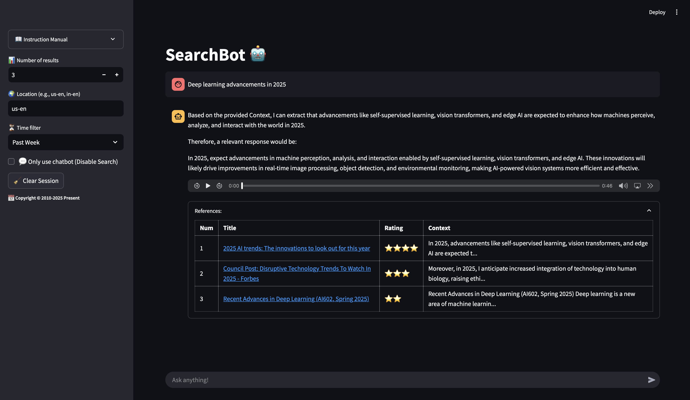

# SearchBot 🤖


SearchBot is an advanced AI-powered research assistant that helps you find the latest news, trends, and information across various sources. It uses Streamlit for the user interface and integrates with DuckDuckGo for news searches.

## Features

- **AI-Powered Search**: Search for the latest news, research papers, and web articles.
- **Customizable Search**: Filter results by location and time.
- **Interactive Chatbot**: Get summarized responses with references.
- **Audio Responses**: Convert responses to audio using Google Text-to-Speech (gTTS).

## Installation

1. **Clone the repository**:
    ```sh
    git clone https://github.com/DKethan/searchbot.git
    cd searchbot
    ```

2. **Create a virtual environment and activate it**:
    ```sh
    python3 -m venv sb-001
    source sb-001/bin/activate  # On Windows use `sb-001\Scripts\activate`
    ```

3. **Install the required packages**:
    ```sh
    pip install -r requirements.txt
    ```

## Usage

1. **Run the Streamlit app**:
    ```sh
    streamlit run app.py
    ```

2. **Open your web browser and go to** `http://localhost:8501`.

## How to Use

1. **Choose Search Source**: Select the type of search (News, Research Papers, Web Articles).
2. **Choose Number of Results**: Decide how many results you want (1 to 10).
3. **Set Location**: Customize search results based on location (e.g., "us-en" for USA, "in-en" for India).
4. **Filter by Time**: Search for the most recent news or past articles:
    - **Past Day** (Breaking News)
    - **Past Week** (Trending Topics)
    - **Past Month** (Major Stories)
    - **Past Year** (Deep Research)
5. **Review Search Results & Chat History**: View results in an interactive table. The chatbot provides summarized responses with references.

## Project Structure

- `app.py`: Main application file that sets up the Streamlit interface and handles user interactions.
- `helper.py`: Contains helper functions and classes for the chatbot, news search, and audio conversion.

## Dependencies

- `streamlit`: For creating the web interface.
- `httpx`, `requests`, `BeautifulSoup`: For web scraping and HTTP requests.
- `gTTS`: For converting text to speech.
- `keras`, `numpy`: For machine learning models.
- `selenium`: For web automation.
- `huggingface_hub`: For downloading models from Hugging Face.

## License

This project is licensed under the MIT License. See the [LICENSE](LICENSE) file for details.

## Acknowledgements

- [Streamlit](https://streamlit.io/)
- [DuckDuckGo](https://duckduckgo.com/)
- [Google Text-to-Speech](https://pypi.org/project/gTTS/)
- [Hugging Face](https://huggingface.co/)

## Detailed Setup Instructions

### Prerequisites

- Python 3.8 or higher
- pip (Python package installer)

### Step-by-Step Setup

1. **Clone the repository**:
    ```sh
    git clone https://github.com/yourusername/searchbot.git
    cd searchbot
    ```

2. **Create a virtual environment**:
    ```sh
    python3 -m venv sb-001
    ```

3. **Activate the virtual environment**:
    - On macOS/Linux:
        ```sh
        source sb-001/bin/activate
        ```
    - On Windows:
        ```sh
        sb-001\Scripts\activate
        ```

4. **Install the dependencies**:
    ```sh
    pip install -r requirements.txt
    ```

5. **Run the application**:
    ```sh
    streamlit run app.py
    ```

6. **Access the application**:
    Open your web browser and navigate to `http://localhost:8501`.

## Contributing

We welcome contributions! Please follow these steps to contribute:

1. Fork the repository.
2. Create a new branch (`git checkout -b feature-branch`).
3. Make your changes.
4. Commit your changes (`git commit -m 'Add some feature'`).
5. Push to the branch (`git push origin feature-branch`).
6. Open a pull request.

## Troubleshooting

### Common Issues

- **Dependency Installation**: If you encounter issues during `pip install`, ensure you have the correct version of Python and pip installed.

### Getting Help

If you encounter any issues or have questions, please open an issue on the GitHub repository.

## Future Enhancements

- **Additional Search Sources**: Integrate more search sources like Google Scholar, Bing, etc.
- **Advanced Filtering**: Add more advanced filtering options for search results.
- **User Authentication**: Implement user authentication for personalized search history and preferences.

## Contact

For any inquiries or support, please contact kethandoapati@gmail.com.